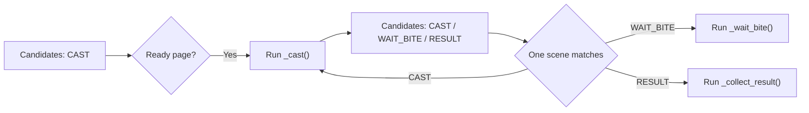

# SceneFlow Author Guide

`SceneFlow` is a lightweight pipeline in the codebase. It only handles "which scenes may be recognized now, where the flow may go after success, and when to retry or recover". OCR, clicks, key presses, routes, and long-running business loops remain in task actions.

## How One Flow Cycle Runs

```python
flow.step(
    FishingStep.CAST,
    self.is_ready_to_cast,
    self._cast,
    next=(FishingStep.CAST, FishingStep.WAIT_BITE, FishingStep.RESULT),
    policy=StepPolicy(max_attempts=4, interval=2),
    on_failure=self._route_cast_failure,
)
```

This means:

1. `_cast()` runs only when `CAST` is in the current candidate set and `is_ready_to_cast()` returns true.
2. If `_cast()` does not raise an exception, it is considered complete. Its return value is ignored.
3. After completion, only `CAST`, `WAIT_BITE`, and `RESULT` may be recognized. `next` does not immediately call the next action; it defines the set of scenes that may be recognized in the next cycle.
4. Because `CAST` is included in `next`, the flow may cast again while the ready page is still visible. An action that does not include itself is not replayed by the framework.
5. If the flow is still at `CAST` after four attempts, `_route_cast_failure()` decides whether to restock or end the current cycle.



## API

```python
flow.step(key, detector, action, *, next, policy=None, transition=None, on_failure=None)
```

| Parameter | Meaning |
| --- | --- |
| `key` | Step enum. |
| `detector` | A scene-detection function without side effects. |
| `action` | The business action. Its return value is not used; successful completion does not raise, while failure raises `WaitFailedException`. |
| `next` | Successor steps that may be recognized after the action succeeds. It must not be empty. An action may run again only when its own key is included. |
| `policy` | The retry count and minimum interval for the current action. |
| `transition` | Lightweight input repeated during a known page transition, such as Escape. |
| `on_failure` | Local routing when the current step cannot continue. |

### `StepPolicy`

```python
StepPolicy(max_attempts=None, interval=0.0)
```

- `max_attempts`: The maximum number of times the same action may run. `None` means unlimited.
- `interval`: The minimum delay before running the same action again. It does not replace throttling for the click or key press itself.

`StepPolicy` does not manage action duration. Long actions own their domain-specific timeout, such as the fishing bar's `CONTROL_TIMEOUT`. This follows the same responsibility split as the MAA Pipeline: the pipeline recognizes successor scenes after an action completes, while the node layer provides `maxTimes`, error routing, and delays around the action rather than one shared action timeout. See the [MAA task flow protocol](https://docs.maa.plus/zh-cn/protocol/task-schema.html).

If an action raises `WaitFailedException`:

- If a successor scene is already visible, enter that successor directly.
- If the original scene is still visible and `max_attempts` has not been reached, wait for `interval` and retry.
- Otherwise, enter `on_failure`.

### `on_failure`

```python
def _route_cast_failure(self, failure: StepFailure) -> FishingStep | None:
    if self.config[self.CONF_AUTO_BUY_BAIT]:
        return FishingStep.OPEN_SELL
    self.add_failed("Could not detect the casting state")
    return FishingStep.CAST
```

`on_failure` is called only after the framework confirms that the current step cannot continue, such as when `max_attempts` is reached or the action raises a non-retryable `WaitFailedException`.

- Returning a registered step immediately switches detection to that step only.
- Returning `None` enters global `recovery()`.
- Without `on_failure`, the flow also enters `recovery()`.

## Known Transitions and Unknown Recovery

Both use `interval` to throttle repeated input, but their trigger conditions differ.

```python
return_to_ready = flow.transition(
    lambda: self.send_key("esc"),
    interval=2,
    timeout=60,
)

flow.step(
    FishingStep.RESULT,
    self.has_success_overlay,
    self._collect_result,
    next=(FishingStep.CAST,),
    transition=return_to_ready,
)
```

- `transition()` runs once immediately after the source action completes, then retries at `interval` while waiting for a `next` scene. Its `timeout` starts when the action returns.
- `recovery()` handles unknown scenes where no candidate step is visible, or where a failure route returns `None`. It waits for a five-second `grace` period by default, then runs the recovery action at `interval`.

```python
flow.recovery(
    self._recover_fishing_scene,
    grace=5,
    interval=2,
    max_attempts=180,
    timeout=360,
)
```

Fishing's `_recover_fishing_scene()` can release the control-bar key before sending Escape; an ordinary transition can simply use `lambda: self.send_key("esc")`.

## Guards and Interrupts

- `guard()` takes priority over ordinary steps, but does not change the current candidate set. The fishing TEAM guard re-enters the fishing spot and then continues waiting for the original restocking or fishing step.
- `interrupt()` takes priority over guards. The monthly-pass interrupt is registered centrally in `BaseNTETask`.
- Ordinary `wait_until()` checks interrupts automatically. Custom high-frequency loops should call `self.scene_flow.safe_point()`; an interrupt raises `SceneReplan` and triggers reclassification.
- An action interrupted by `SceneReplan` does not count toward `max_attempts`.

## Minimal Checklist

1. Is the detector read-only, with no input side effects?
2. Does the action perform one business submission? Does it raise `WaitFailedException` on failure?
3. Is every scene that may really appear after success included in `next`?
4. Is another input truly needed? Include the current key in `next` only when it is.
5. Does a long action define its own business timeout inside the action?
6. Are known exit pages handled with `transition`, while unknown scenes go to `recovery`?
