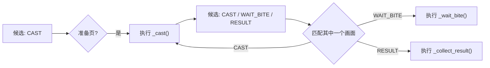

# SceneFlow 作者指南

`SceneFlow` 是代码内的轻量 Pipeline。它只处理“当前允许识别什么画面, 成功后允许到哪里去, 何时重试或恢复”。OCR、点击、按键、路线和长时间业务循环仍写在任务 action 中。

## 一轮流程如何运行

```python
flow.step(
    FishingStep.CAST,
    self.is_ready_to_cast,
    self._cast,
    next=(FishingStep.CAST, FishingStep.WAIT_BITE, FishingStep.RESULT),
    policy=StepPolicy(max_attempts=4, interval=2),
    on_failure=self._route_cast_failure,
)
```

其含义是:

1. 只有 `CAST` 在当前候选集内, 且 `is_ready_to_cast()` 为真时, 才执行 `_cast()`。
2. `_cast()` 没有抛异常就视为完成。它的返回值会被忽略。
3. 完成后只允许识别 `CAST`、`WAIT_BITE`、`RESULT`。`next` 不是立即调用下一 action, 而是下一轮的可识别范围。
4. `CAST` 写在 `next` 中, 所以准备页仍然可见时可以再次抛竿。没有写入自身的 action 不会被框架重放。
5. 四次后仍停在 CAST, 则调用 `_route_cast_failure()` 决定去补货还是结束当前轮。



## API

```python
flow.step(key, detector, action, *, next, policy=None, transition=None, on_failure=None)
```

| 参数 | 含义 |
| --- | --- |
| `key` | 步骤 Enum。 |
| `detector` | 无副作用的画面判断函数。 |
| `action` | 业务动作。返回值不参与流程; 成功不抛异常, 失败抛 `WaitFailedException`。 |
| `next` | action 成功后允许识别的后继步骤, 必须非空。只有把自身写入其中才允许再次执行 action。 |
| `policy` | 当前 action 的重复次数和最小间隔。 |
| `transition` | 已知页面切换期间重复执行的轻量输入, 例如 Escape。 |
| `on_failure` | 当前步骤已无法继续时的局部路由。 |

### `StepPolicy`

```python
StepPolicy(max_attempts=None, interval=0.0)
```

- `max_attempts`: 同一个 action 最多执行几次。`None` 表示不限制。
- `interval`: 同一个 action 再次执行前的最小间隔。它不替代点击或按键自身的节流。

`StepPolicy` 不管理 action 的执行时长。长动作自己拥有领域 timeout, 例如钓鱼控条的 `CONTROL_TIMEOUT`。这和 MAA Pipeline 的职责一致: Pipeline 在 action 完成后才继续识别后继步骤; 节点层主要提供 `maxTimes`、错误路由以及 action 前后的 delay, 而非统一的 action timeout。[MAA 任务流程协议](https://docs.maa.plus/zh-cn/protocol/task-schema.html)

如果 action 抛出 `WaitFailedException`:

- 后继画面已经出现时, 直接进入后继步骤;
- 原画面仍在且未达到 `max_attempts` 时, 等待 `interval` 后重试;
- 否则进入 `on_failure`。

### `on_failure`

```python
def _route_cast_failure(self, failure: StepFailure) -> FishingStep | None:
    if self.config[self.CONF_AUTO_BUY_BAIT]:
        return FishingStep.OPEN_SELL
    self.add_failed("未检测到进入抛竿状态")
    return FishingStep.CAST
```

`on_failure` 只在框架确认当前步骤不能继续时调用, 例如达到 `max_attempts` 或 action 抛出不可重试的 `WaitFailedException`。

- 返回已注册的步骤: 立即切换为只识别该步骤;
- 返回 `None`: 进入全局 `recovery()`;
- 没有 `on_failure`: 同样进入 `recovery()`。

## 已知切换与未知恢复

两者都用 `interval` 节流重复输入, 但触发条件不同。

```python
return_to_ready = flow.transition(
    lambda: self.send_key("esc"),
    interval=2,
    timeout=60,
)

flow.step(
    FishingStep.RESULT,
    self.has_success_overlay,
    self._collect_result,
    next=(FishingStep.CAST,),
    transition=return_to_ready,
)
```

- `transition()` 在 source action 成功完成后立刻执行一次, 并在等待 `next` 页面时按 `interval` 重试。它的 `timeout` 从 action 返回后开始计算。
- `recovery()` 只处理候选步骤都不可见, 或失败路由返回 `None` 的未知画面。它默认先等待 5 秒 `grace`, 之后才按 `interval` 执行恢复动作。

```python
flow.recovery(
    self._recover_fishing_scene,
    grace=5,
    interval=2,
    max_attempts=180,
    timeout=360,
)
```

钓鱼的 `_recover_fishing_scene()` 可在发送 Escape 前释放控条按键; 普通 transition 则直接写 `lambda: self.send_key("esc")` 即可。

## Guard 与中断

- `guard()` 优先于普通 step, 但不修改当前候选集。钓鱼的 TEAM guard 重新进入钓鱼点后, 会继续等待原来的补货或钓鱼步骤。
- `interrupt()` 优先于 guard。月卡中断在 `BaseNTETask` 中统一注册。
- 普通 `wait_until()` 已自动检查中断。自定义高频循环调用 `self.scene_flow.safe_point()`; 发现中断会抛 `SceneReplan` 并重新分类。
- 被 `SceneReplan` 中断的 action 不计入 `max_attempts`。

## 最小检查表

1. detector 是否只读画面, 没有输入副作用?
2. action 是否只完成一次业务提交? 失败是否抛 `WaitFailedException`?
3. 成功后真实可能出现的每个画面是否都在 `next`?
4. 是否真的要再次输入? 需要才把当前 key 放入 `next`。
5. 长动作是否在 action 内部设置自己的业务 timeout?
6. 已知退出页面是否使用 transition, 未知画面是否交给 recovery?
